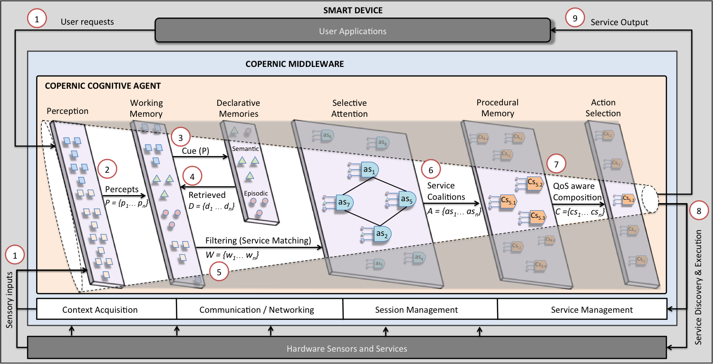
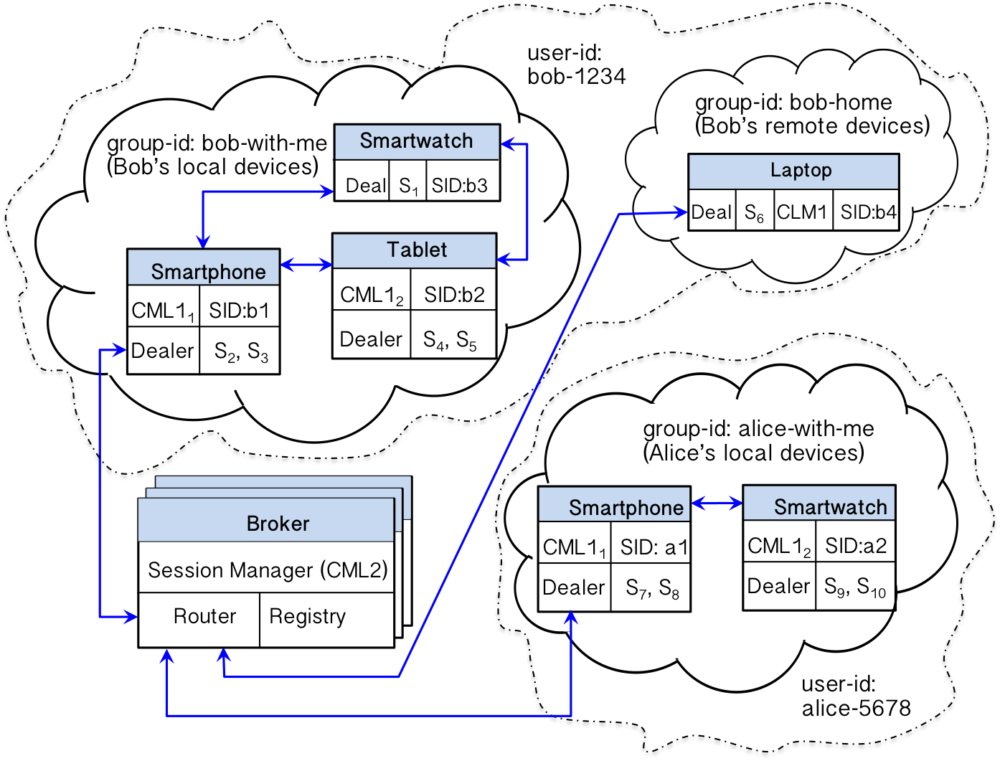

# COPERNIC

Status for master branch:

[//]: # (this is a comment: see this link for badges using travis-CI, codecov, etc: https://github.com/mlindauer/SMAC3/blob/warmstarting_multi_model/README.md) 
 
 
 

Implementation:

 
 

(See a demo here: <a href="https://drive.google.com/open?id=1UTuc8qolEryF4xxTRj8o7UvSRWjOaPyn">video</a>)

## Overview

**COPERNIC** stands for **CO**gnitively-inspired **P**ervasive middl**E**ware for eme**R**ge**N**t serv**I**ce **C**omposition. 

Automatic service composition in pervasive computing faces many challenges due to the complex and highly dynamic nature of the environment. Common approaches consider service composition as a decision problem whose solution is usually addressed from optimization perspectives which are not feasible in practice due to the intractability of the problem, limited computational resources of smart devices, service host's mobility, and time constraints to tailor composition plans. COPERNIC is a cognitively-inspired agent-based service composition model focused on bounded rationality rather than optimality, which allows the system to compensate for limited resources by selectively filtering out continuous streams of data. COPERNIC exhibits features such as distributedness, modularity, emergent global functionality, and robustness, which endow it with capabilities to perform decentralized service composition by orchestrating manifold service providers and conflicting goals from multiple users. COPERNIC provides:

1. A Communication layer for:
	* Discovering devices in a proximity network using sockets UDP
	* Communicating with remote devices and services in WAN networks through sockets TCP
	* Messaging library with minimal latency footprint
2. A Service layer for:
	* Service Management (registration, lookup, etc.)
	* Service Discovery through Semantic descriptions (work in progress)
	* Service composition using hybrind methods (classic AI planning methods and spreading activation dynamics) in pervasive environments
	* Machine Learning to improve adaptivity of service composition (work in progress)
3. A Session Management layer for:
	* Session control: creation and removal (by expiration) of sessions
	* Cross-session coordination: a single user shares the same session across multiple devices (e.g., tablets, phones, smartwatches, etc.)
	* Cross-user coordination: service composition may require multiple users involved in the construction of emergent plans.

COPERNIC Architecture:

       

* **Step 1**: the Perception module makes sense of the agent's current state by processing both external (e.g., user requests) and internal (i.e., signals from other modules) sensory inputs, categorizing that information, and recognizing situations where a set of abstract services may be triggered. 
* **Step 2**: the Perception module outputs a set of symbolic structures (percepts) that are stored in a Working Memory (WM) for further processing as abstract service inputs. 
* **Step 3**: the WM cues the declarative memories (i.e., Episodic Memory that retrieves information about historic performance of services, context, etc., and Semantic Memory that retrieves service definitions, user preferences, etc.)
* **Step 4**: local associations are stored in WM
* **Step 5**: the content of the WM is filtered out by the attention mechanism so the agent only focuses on the most relevant information needed for matching abstract services. 
* **Step 6**: goals are decomposed and abstract services compete and cooperate (creating coalitions) among them in order to get the focus of attention.
* **Step 7**: the Procedural Memory executes a set of heuristics to dynamically bind abstract services to concrete services by validating the QoS requirements.
* **Step 8**: the Action Selection chooses the most appropriate action to execute a concrete service using discovery protocols adapted to the heterogeneous nature of the environment (the process is repeated until all sub-goals are satisfied). 
* **Step 9**: service's output is returned to the application. 

Unlike traditional approaches that create upfront composition plans which are prone to inadaptability, in COPERNIC, plans emerge from the interaction of cascading sequences of **cognitive cycles** corresponding to perception-action loops (steps 1-8) where compositional conditions are validated in every cycle. This allows service composition to be more reactive, robust, and adaptive to dynamic changes while composition plans are generated on-the-fly by using minimal resources as a result of filtering out a continuous stream of information.

Distributed Architecture:

       

