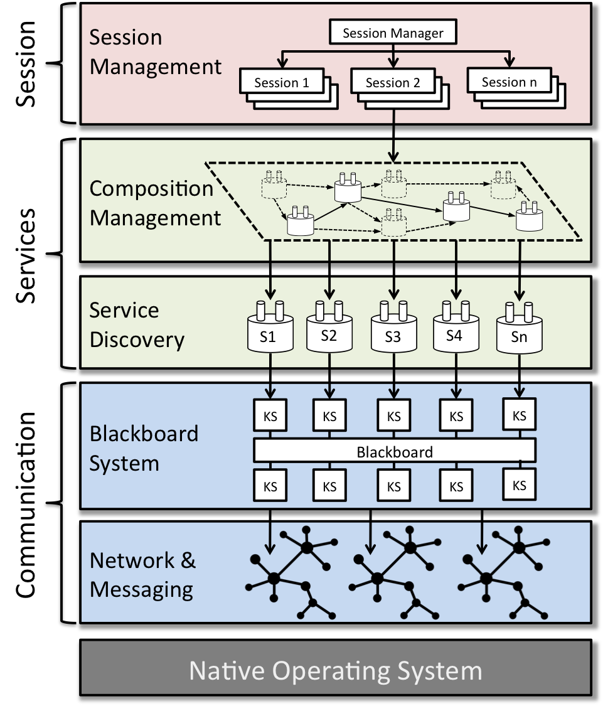

# HARLEQUIN

**HARLEQUIN** stands for **H**ybrid, **A**daptive, high-pe**R**formance midd**LE**ware for ubi**QUI**tous e**N**vironments. HARLEQUIN provides:

1. A Communication layer for:
	1.1 Discovering devices in a proximity network using sockets UDP
	1.2 Communicating with remote devices and services in WAN networks through sockets TCP
	1.3 Messaging library with minimal latency footprint
2. A Service layer for:
	2.1 Service Management (registration, lookup, etc.)
	2.2 Service Discovery through Semantic descriptions (work in progress)
	2.3 Service composition using hybrind methods (classic AI planning methods and spreading activation dynamics) in pervasive environments
	2.4 Machine Learning to improve adaptivity of service composition (work in progress)

3. A Session Management layer for:
	3.1 Session control: creation and removal (by expiration) of sessions
	3.2 Cross-session coordination: a single user shares the same session across multiple devices (e.g., tablets, phones, smartwatches, etc.)
	3.3 Cross-user coordination: service composition may require multiple users involved in the construction of emergent plans.

       

       

